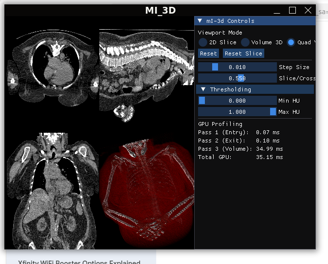
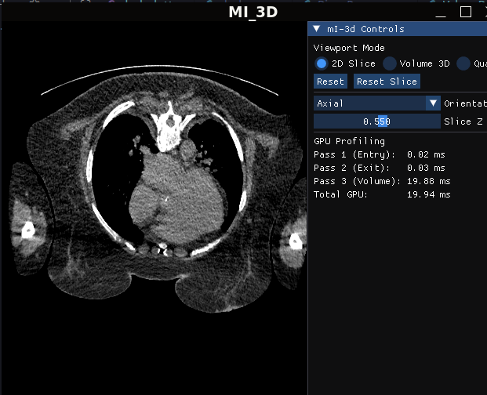
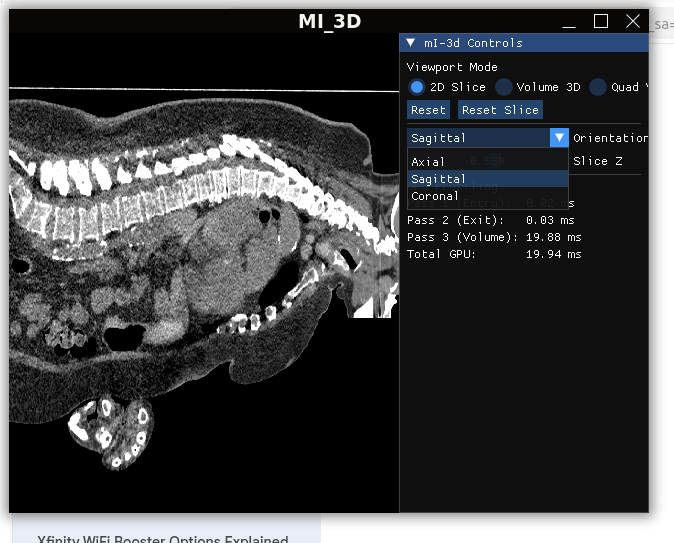
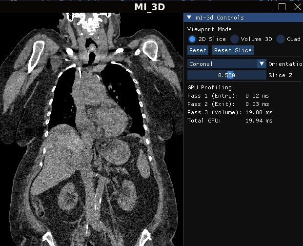
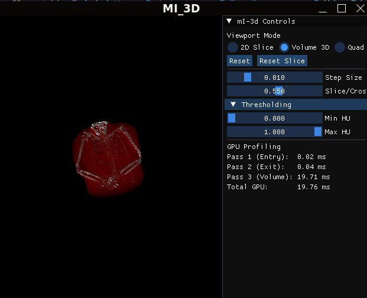

# MI_3D — Medical Imaging 3D Viewer

Cross-platform medical imaging application built from scratch in C++ and OpenGL.
Renders CT scan images from DICOM files with interactive 2D and 3D visualizations.




## Scope
This project demonstrates low-level graphics programming and medical 
imaging data pipeline development. It covers the full stack from binary 
DICOM file parsing to GPU-accelerated volume rendering — built without 
high-level frameworks or engines. The application handles real clinical 
CT datasets and runs on both Windows and Linux.


## Intent

Built as a portfolio project targeting 3D graphics software engineering 
roles in medical imaging and scientific visualization. Demonstrates 
hands-on C++ and OpenGL proficiency — from memory management and RAII 
to GPU shader programming and real-time rendering.

## Features

- **2D Slice Viewer** — Browse CT slices in axial, sagittal, and coronal orientations with window/level controls
- **3D Volume Rendering** — GPU ray-casting with transfer function coloring and Phong lighting
- **Quad View** — Four-panel layout showing all three 2D orientations alongside the 3D volume
- **Real DICOM Support** — Byte-level parser handles real clinical CT datasets with rescale slope/intercept
- **GPU Profiling** — Built-in timer queries display per-pass rendering cost in milliseconds
- **Interactive Controls** — Mouse rotation, scroll zoom, keyboard shortcuts (1/2/3/R), clipping plane
- **Cross-Platform** — Builds and runs on Windows (MSVC) and Linux (GCC)

### 2D Slice Viewer





### 3D Volume Rendering

 
### Quad View


## Architecture

The application follows a single-ownership RAII design. `Application` 
owns all subsystems via `unique_ptr` and orchestrates the render loop.

### Class Structure:
    main.cpp
    - Application
    - Window (GLFW wrapper)
    - Camera (orbital arcball)
    - Shader (slice, raycast, volume)
    - UIManager (ImGui panels)
    - DicomParser (stateless, byte-level)
    - VolumeData (3D voxel array)
### Data Pipeline
    .dcm files → DicomParser → DicomSlice → VolumeData → glTexImage3D → GPU

### Render Pipeline (per frame)
    Pass 1: Cube front faces → Entry FBO (ray start positions)
    Pass 2: Cube back faces  → Exit FBO (ray end positions)
    Pass 3: Screen quad      → Volume shader (ray march + lighting)

### File Layout
    MI_3D/
    |----- src/core/    Application, Window, Camera
    |----- src/render/ Shader
    |----- src/medical/ DicomParser, VolumeData
    |----- src/ui/ UIManager
    |----- shaders/ slice, raycast_entry, volume
    

## Build Instructions

### Linux
```bash
# Prerequisites
sudo apt install build-essential cmake libgl1-mesa-dev libxrandr-dev libxinerama-dev libxcursor-dev libxi-dev
pip3 install pydicom numpy

# Clone and build
git clone https://github.com/Chhetrikushal11/MI_3D.git
cd MI_3D
python3 generate_dicom.py
cmake -B build -DCMAKE_BUILD_TYPE=Release
cmake --build build

# Run
./build/MI_3D
```

### Windows
```bash
# Prerequisites: Visual Studio 2022, CMake 3.28+, Python 3
pip install pydicom numpy

# Clone and build
git clone https://github.com/Chhetrikushal11/MI_3D.git
cd MI_3D
python generate_dicom.py
cmake -B build
cmake --build build --config Release

# Run
.\build\Release\MI_3D.exe
```

## Tech Stack

- **Language:** C++17
- **Graphics API:** OpenGL 4.1 Core Profile
- **Windowing:** GLFW 3.4
- **Math:** GLM 1.0.1
- **UI:** Dear ImGui
- **GL Loader:** GLAD
- **Build System:** CMake 3.28+
- **Profiling:** OpenGL Timer Queries, RenderDoc

## Performance & Profiling

### GPU Timer Queries
Built-in OpenGL timer queries measure each rendering pass per frame:

| Pass   |            Operation               |   Time   |
|--------|------------------------------------|----------|
| Pass 1 | Entry positions (cube front faces) | 0.02 ms  |
| Pass 2 | Exit positions (cube back faces)   | 0.02 ms  | 
| Pass 3 | Volume ray-casting + lighting      | 12.07 ms |
|--------------------------------------------------------|
| **Total**                                |**12.11 ms** |
|--------------------------------------------------------|

Pass 3 accounts for 99.7% of GPU time. Passes 1 and 2 draw 
12 triangles each — trivial work.

### Bottleneck Analysis
Disabling gradient lighting dropped Pass 3 from 12.07ms to 3.48ms, 
revealing that gradient computation (6 texture reads per visible 
voxel for central differences) accounts for 71% of frame time.

### Optimization Attempts

|                Optimization                        |            Result            |           Decision           |
|----------------------------------------------------|------------------------------|------------------------------|
| Forward difference gradient (3 reads instead of 6) | 21ms, lighting artifacts     | Rejected — quality loss      |
| Adaptive air skip (4× step in empty space)         | 15.6ms, slower than baseline | Rejected — branch divergence |
| Early ray termination (alpha > 0.99)               | Already implemented          | Kept                         |
| Early ray length check                             | ~0.1ms savings               | Kept                         |

### Key Finding: Branch Divergence on Integrated GPU
Adaptive stepping performed worse because adjacent pixels in a GPU 
warp take different branches (air vs tissue), forcing the SIMD 
hardware to execute both paths. Uniform computation patterns 
outperform branchy code on Intel Iris Xe shared memory architecture.

### RenderDoc Verification
Frame capture confirmed correct pipeline state — all four texture 
units bound with expected formats (R16G16B16A16_FLOAT for FBOs, 
R16_SNORM for volume, R8G8B8A8_UNORM for transfer function). 
No redundant state changes or pipeline inefficiencies detected.

## Rendering Approach

The application uses GPU ray-casting to render 3D volumes. A bounding 
cube captures ray entry and exit positions into framebuffer textures 
using two render passes. A third pass marches rays through the 3D 
volume texture, sampling density at each step. 

Density values are converted to Hounsfield Units using DICOM rescale 
parameters, then mapped to color and opacity via a 1D transfer function 
texture. Surface normals are estimated using central difference gradients, 
enabling Phong lighting for depth perception. Colors accumulate 
front-to-back with early ray termination at opacity 0.99.

## Development Log

| Week |          Focus   |                                   Key Deliverable                                  |
|------|------------------|------------------------------------------------------------------------------------|
| 1    | Foundation       | CMake, GLFW, GLAD, Shader class, first triangle                                    |
| 2    | Interaction      | Orbital camera, EBO cube, ImGui debug panel, Application refactor                  |
| 3    | Medical Data     | DICOM byte-level parser, VolumeData, 2D slice viewer (axial/sagittal/coronal)      |
| 4-5  | Volume Rendering | FBO setup, entry/exit shaders, MIP, transfer function, compositing, Phong lighting |
| 6    | Polish           | Quad view, keyboard shortcuts, window resize, real DICOM support, rescale pipeline |
| 7    | Optimization     | GPU timer queries, profiling, RenderDoc analysis, branch divergence findings       |

## Future Work

- **Octree Empty Space Skipping** — Precompute an octree of the volume to skip air regions without branch divergence
- **Precomputed Gradient Texture** — Compute surface normals once during loading to reduce per-frame texture reads from 6 to 1
- **Vulkan Port** — Rebuild the renderer in Vulkan for explicit memory control and pipeline optimization
- **Multi-dataset Support** — Load and switch between datasets via file dialog without recompiling
- **Measurement Tool** — Click-to-measure distances in real-world millimeters using DICOM pixel spacing

MIT License

Copyright (c) 2026 Kushal Basnet

Permission is hereby granted, free of charge, to any person obtaining a copy
of this software and associated documentation files (the "Software"), to deal
in the Software without restriction, including without limitation the rights
to use, copy, modify, merge, publish, distribute, sublicense, and/or sell
copies of the Software, and to permit persons to whom the Software is
furnished to do so, subject to the following conditions:

The above copyright notice and this permission notice shall be included in all
copies or substantial portions of the Software.

THE SOFTWARE IS PROVIDED "AS IS", WITHOUT WARRANTY OF ANY KIND, EXPRESS OR
IMPLIED, INCLUDING BUT NOT LIMITED TO THE WARRANTIES OF MERCHANTABILITY,
FITNESS FOR A PARTICULAR PURPOSE AND NONINFRINGEMENT. IN NO EVENT SHALL THE
AUTHORS OR COPYRIGHT HOLDERS BE LIABLE FOR ANY CLAIM, DAMAGES OR OTHER
LIABILITY, WHETHER IN AN ACTION OF CONTRACT, TORT OR OTHERWISE, ARISING FROM,
OUT OF OR IN CONNECTION WITH THE SOFTWARE OR THE USE OR OTHER DEALINGS IN THE
SOFTWARE.

## License

This project is licensed under the MIT License — see [LICENSE](LICENSE) for details.

Medical imaging datasets used for development and testing are publicly 
available for research and educational purposes. No clinical data is 
included in this repository.